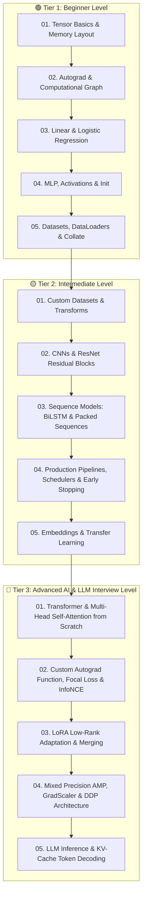

# 🤖 PyTorch AI & Deep Learning Mastery Roadmap

Welcome to the **AI & PyTorch Learning Suite**! This curriculum is organized into three progressive levels (Beginner, Intermediate, and Senior/Staff AI & LLM Interview Level), complete with mathematical foundations, production best practices, and runnable solutions with self-verifying test suites.

---

## 🗺️ Learning Progression Pathway



---

## 📁 Curriculum Index & Practice Files

### 🟢 1. Beginner Level (`01_beginner_pytorch/`)
* **[01_tensor_basics.py](file:///e:/Learnings/Python-Coding/AI/01_beginner_pytorch/01_tensor_basics.py)**: Tensor creation, broadcasting rules, `view` vs `reshape`, `contiguous()` memory layouts, GPU device management, and Batch Cosine Similarity challenge.
* **[02_autograd_and_computational_graph.py](file:///e:/Learnings/Python-Coding/AI/01_beginner_pytorch/02_autograd_and_computational_graph.py)**: Dynamic DAGs, `requires_grad`, `.backward()`, gradient accumulation gotchas, `torch.no_grad()` vs `torch.inference_mode()`, and gradient descent optimization from scratch.
* **[03_linear_and_logistic_regression.py](file:///e:/Learnings/Python-Coding/AI/01_beginner_pytorch/03_linear_and_logistic_regression.py)**: End-to-end training loop, MSE loss, `BCEWithLogitsLoss` numerical stability, and binary classification metrics.
* **[04_neural_network_mlp.py](file:///e:/Learnings/Python-Coding/AI/01_beginner_pytorch/04_neural_network_mlp.py)**: `nn.Module` and `nn.Sequential`, GELU/SiLU activations, Kaiming/He weight initialization, `nn.CrossEntropyLoss`, and model checkpointing (`state_dict`).
* **[05_datasets_and_dataloaders.py](file:///e:/Learnings/Python-Coding/AI/01_beginner_pytorch/05_datasets_and_dataloaders.py)**: Custom `Dataset` class, `DataLoader` options, and custom `collate_fn` for variable-length NLP sequence padding.

---

### 🟡 2. Intermediate Level (`02_intermediate_pytorch/`)
* **[01_custom_datasets_and_transforms.py](file:///e:/Learnings/Python-Coding/AI/02_intermediate_pytorch/01_custom_datasets_and_transforms.py)**: Composable image/feature transforms, normalization, data augmentations, and `random_split`.
* **[02_cnn_and_residual_blocks.py](file:///e:/Learnings/Python-Coding/AI/02_intermediate_pytorch/02_cnn_and_residual_blocks.py)**: Conv2d spatial arithmetic, BatchNorm, 1x1 projection shortcuts, Global Average Pooling, and ResNet `BasicBlock` from scratch.
* **[03_sequence_models_rnn_lstm.py](file:///e:/Learnings/Python-Coding/AI/02_intermediate_pytorch/03_sequence_models_rnn_lstm.py)**: BiLSTM architecture, hidden state extraction, and `pack_padded_sequence` / `pad_packed_sequence` for variable lengths.
* **[04_training_pipeline_best_practices.py](file:///e:/Learnings/Python-Coding/AI/02_intermediate_pytorch/04_training_pipeline_best_practices.py)**: `CosineAnnealingLR` scheduler, Gradient Clipping (`clip_grad_norm_`), and custom `EarlyStopping` callback.
* **[05_embeddings_and_transfer_learning.py](file:///e:/Learnings/Python-Coding/AI/02_intermediate_pytorch/05_embeddings_and_transfer_learning.py)**: `nn.Embedding` mechanics, freezing pretrained backbone weights, and discriminative learning rates.

---

### 🔴 3. Advanced & AI / LLM Interview Level (`03_advanced_interview_pytorch/`)
* **[01_multihead_attention_and_transformer.py](file:///e:/Learnings/Python-Coding/AI/03_advanced_interview_pytorch/01_multihead_attention_and_transformer.py)**: Scaled Dot-Product Attention, fused $Q, K, V$ projections, Causal Upper-Triangular Masking, and Pre-LN Transformer Decoder block.
* **[02_custom_autograd_and_custom_loss.py](file:///e:/Learnings/Python-Coding/AI/03_advanced_interview_pytorch/02_custom_autograd_and_custom_loss.py)**: Custom `torch.autograd.Function` with analytical `forward` & `backward`, `gradcheck`, Focal Loss (RetinaNet), and InfoNCE Contrastive Loss (SimCLR/CLIP).
* **[03_lora_from_scratch.py](file:///e:/Learnings/Python-Coding/AI/03_advanced_interview_pytorch/03_lora_from_scratch.py)**: Low-Rank Adaptation ($h = W_0x + \frac{\alpha}{r}BAx$) from scratch, parameter freezing, and zero-latency weight merging.
* **[04_mixed_precision_and_distributed.py](file:///e:/Learnings/Python-Coding/AI/03_advanced_interview_pytorch/04_mixed_precision_and_distributed.py)**: Automatic Mixed Precision (`torch.amp.autocast`), `GradScaler` against underflow, and DDP vs DP vs FSDP / ZeRO memory breakdown.
* **[05_llm_inference_kv_cache.py](file:///e:/Learnings/Python-Coding/AI/03_advanced_interview_pytorch/05_llm_inference_kv_cache.py)**: Step-by-step KV-Cache implementation for LLM generation ($O(1)$ token step complexity) and Rotary Position Embeddings (RoPE).

---

## ⚡ How to Run & Verify

Run any module directly with Python:
```bash
python AI/01_beginner_pytorch/01_tensor_basics.py
python AI/02_intermediate_pytorch/02_cnn_and_residual_blocks.py
python AI/03_advanced_interview_pytorch/01_multihead_attention_and_transformer.py
python AI/03_advanced_interview_pytorch/03_lora_from_scratch.py
python AI/03_advanced_interview_pytorch/05_llm_inference_kv_cache.py
```
Each file includes its own self-testing assertion suite and benchmarks.
