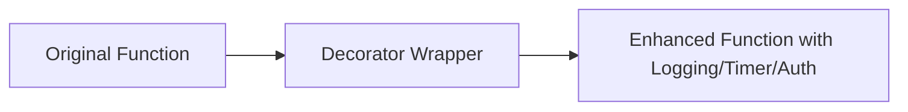

# Decorators in Python 🎨

## Table of Contents
1. [What is a Decorator? (Simple Intuition)](#what-is-a-decorator)
2. [Prerequisites: First-Class Functions & Closures](#first-class-functions)
3. [Basic Function Decorators](#basic-decorators)
4. [Preserving Function Metadata (`functools.wraps`)](#functools-wraps)
5. [Decorators Accepting Arguments](#decorators-with-arguments)
6. [Chaining Multiple Decorators (Execution Order)](#chaining-decorators)
7. [Class-Based Decorators (`__call__`)](#class-based-decorators)
8. [Decorating Methods in Classes](#decorating-methods)
9. [Real-World Production Use Cases (Timing, Retry, Rate Limiting, Caching)](#production-use-cases)
10. [Common Pitfalls & Interview Questions](#interview-questions)

---

## 1. What is a Decorator? {#what-is-a-decorator}

A **decorator** is simply a function that takes another function as an argument, adds some new behavior (or modifications) to it, and returns the modified function — **without changing the original function's source code**.



### The `@` Syntax (Syntactic Sugar)
Writing:
```python
@my_decorator
def greet():
    print("Hello!")
```
Is 100% equivalent to:
```python
def greet():
    print("Hello!")
greet = my_decorator(greet)
```

---

## 2. Prerequisites: First-Class Functions & Closures {#first-class-functions}

In Python, functions are **first-class citizens**:
1. You can assign functions to variables.
2. You can pass functions as arguments to other functions.
3. You can return functions from inside other functions.
4. An inner function can remember variables from its enclosing scope (**Closure**).

```python
def outer_greeting(prefix):
    def inner_greet(name):
        return f"{prefix}, {name}!"
    return inner_greet

say_hello = outer_greeting("Hello")
print(say_hello("Alice"))  # Output: Hello, Alice!
```

---

## 3. Basic Function Decorators {#basic-decorators}

```python
def my_logger(func):
    def wrapper(*args, **kwargs):
        print(f"--> [LOG]: Calling function '{func.__name__}' with args={args}, kwargs={kwargs}")
        result = func(*args, **kwargs)
        print(f"<-- [LOG]: Function '{func.__name__}' returned {result}")
        return result
    return wrapper

@my_logger
def add(a, b):
    return a + b

print(add(10, 20))
```

---

## 4. Preserving Metadata with `functools.wraps` {#functools-wraps}

Without `@functools.wraps`, the decorated function loses its original `__name__`, `__doc__`, and signature:

```python
import functools

def timer_decorator(func):
    @functools.wraps(func)  # Preserves func.__name__, docstring, and signature!
    def wrapper(*args, **kwargs):
        """Wrapper timer docstring."""
        import time
        start = time.perf_counter()
        res = func(*args, **kwargs)
        elapsed = time.perf_counter() - start
        print(f"[{func.__name__}] Elapsed time: {elapsed:.6f}s")
        return res
    return wrapper

@timer_decorator
def compute():
    """Computes heavy mathematical work."""
    return sum(i * i for i in range(100000))

print(compute.__name__)  # Correctly outputs 'compute' (not 'wrapper')
print(compute.__doc__)   # Correctly outputs 'Computes heavy mathematical work.'
```

---

## 5. Decorators Accepting Arguments {#decorators-with-arguments}

To pass arguments into a decorator, create an outer factory function (3 levels of nested functions):

```python
def repeat(num_times: int):
    """Decorator factory that repeats function execution N times."""
    def decorator(func):
        @functools.wraps(func)
        def wrapper(*args, **kwargs):
            res = None
            for i in range(num_times):
                print(f"Execution #{i + 1} of {func.__name__}")
                res = func(*args, **kwargs)
            return res
        return wrapper
    return decorator

@repeat(num_times=3)
def ping():
    print("Pong!")
```

---

## 6. Chaining Multiple Decorators {#chaining-decorators}

When applying multiple decorators, Python applies them **bottom-up** (closest to the function first) and executes them **top-down**:

```python
@decorator_one
@decorator_two
def action():
    pass
# Equivalent to: action = decorator_one(decorator_two(action))
```

---

## 7. Class-Based Decorators {#class-based-decorators}

Classes implementing `__call__` can act as stateful decorators:

```python
class CallCounter:
    def __init__(self, func):
        self.func = func
        self.count = 0
        functools.update_wrapper(self, func)

    def __call__(self, *args, **kwargs):
        self.count += 1
        print(f"Function '{self.func.__name__}' called {self.count} time(s).")
        return self.func(*args, **kwargs)

@CallCounter
def process():
    print("Processing task...")
```

---

## 8. Real-World Production Use Cases {#production-use-cases}

1. **Execution Timer**: Benchmarking database queries and API endpoints.
2. **Automatic Retry with Exponential Backoff**: Retrying network requests on failure.
3. **Authentication & Role Authorization**: Checking user permissions before route execution.
4. **Memoization / Caching**: Storing expensive pure function results (`functools.lru_cache`).
5. **Rate Limiting**: Restricting calls per user per second.
