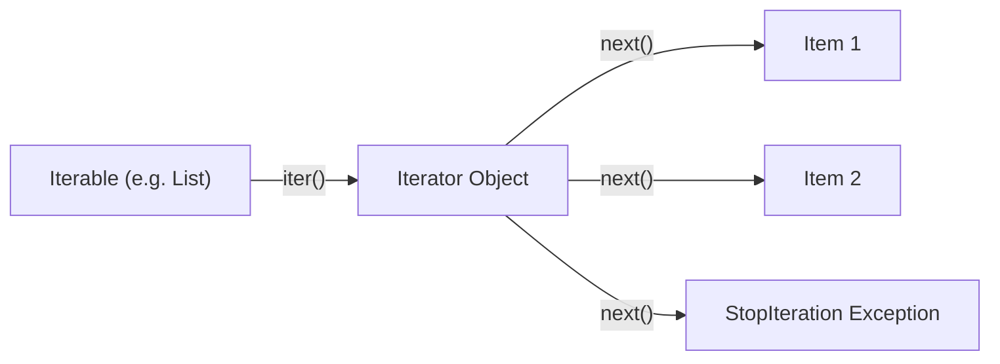

# Generators & Iterators in Python ⚡

## Table of Contents
1. [Iteration Protocol: Iterables vs. Iterators](#iteration-protocol)
2. [Building Custom Iterators (`__iter__` and `__next__`)](#custom-iterators)
3. [Generator Functions (`yield` vs `return`)](#generator-functions)
4. [Memory Efficiency: List Comprehension vs. Generator Expression](#memory-efficiency)
5. [Delegating Generators (`yield from`)](#yield-from)
6. [Bidirectional Generators (`.send()`, `.throw()`, `.close()`)](#coroutine-generators)
7. [Streaming Data Pipelines with Generators](#data-pipelines)
8. [Infinite Sequences & Itertools Suite](#itertools-suite)
9. [Interview Questions & Common Pitfalls](#interview-questions)

---

## 1. Iteration Protocol: Iterables vs. Iterators {#iteration-protocol}

* **Iterable**: An object capable of returning its members one at a time. It implements `__iter__()` returning an iterator (e.g. `list`, `dict`, `set`, `str`).
* **Iterator**: An object representing a stream of data. It implements:
  - `__iter__()`: returns `self`
  - `__next__()`: returns the next item or raises `StopIteration` when finished.



---

## 2. Building Custom Iterators {#custom-iterators}

```python
class CountDown:
    def __init__(self, start: int):
        self.current = start

    def __iter__(self):
        return self

    def __next__(self):
        if self.current <= 0:
            raise StopIteration
        val = self.current
        self.current -= 1
        return val

for num in CountDown(3):
    print(num)  # 3, 2, 1
```

---

## 3. Generator Functions (`yield`) {#generator-functions}

A **generator function** uses the `yield` keyword instead of `return`. When called, it doesn't execute the function immediately — it returns a generator iterator object.
* `yield` pauses the function state and yields a value.
* The next call to `next()` resumes execution immediately after the `yield` statement.

```python
def fibonacci_generator(limit: int):
    a, b = 0, 1
    count = 0
    while count < limit:
        yield a
        a, b = b, a + b
        count += 1
```

---

## 4. Memory Efficiency: Lists vs Generators {#memory-efficiency}

Generators generate items **lazily on-demand** (lazy evaluation).

```python
import sys

# List: Allocates memory for 1,000,000 integers in RAM (~8.5 MB)
list_comp = [x * 2 for x in range(1_000_000)]
print("List Size:", sys.getsizeof(list_comp), "bytes")

# Generator: Fixed memory footprint (~100 bytes) regardless of size!
gen_expr = (x * 2 for x in range(1_000_000))
print("Generator Size:", sys.getsizeof(gen_expr), "bytes")
```

---

## 5. Delegating with `yield from` {#yield-from}

`yield from` simplifies sub-generator delegation and flattens nested data structures:

```python
def flatten_nested(nested_list):
    for item in nested_list:
        if isinstance(item, list):
            yield from flatten_nested(item)
        else:
            yield item

print(list(flatten_nested([1, [2, [3, 4], 5], 6]))) # [1, 2, 3, 4, 5, 6]
```

---

## 6. Streaming Data Pipelines {#data-pipelines}

Generators can be chained together like Unix pipes (`cat | grep | awk`) to process massive datasets (gigabytes/terabytes of log files) with virtually zero memory overhead.
