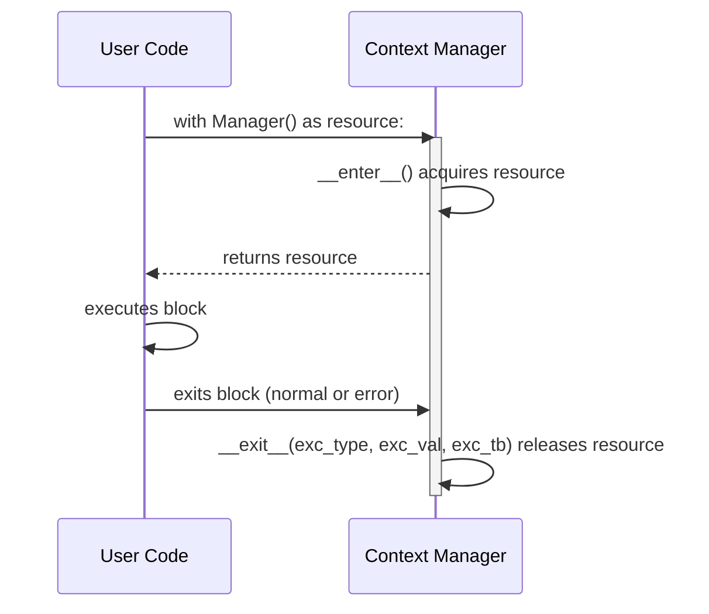

# Context Managers in Python 🛡️

## Table of Contents
1. [What is a Context Manager? (RAII Pattern)](#what-is-a-context-manager)
2. [The `with` Statement Protocol: `__enter__` and `__exit__`](#with-protocol)
3. [Handling and Suppressing Exceptions in `__exit__`](#exception-handling)
4. [Functional Context Managers with `@contextlib.contextmanager`](#contextlib-decorator)
5. [Managing Multiple Resources with `ExitStack`](#exitstack)
6. [Real-World Production Scenarios (Database Transactions, Locks, Temporary Files)](#production-scenarios)
7. [Interview Questions & Common Pitfalls](#interview-questions)

---

## 1. What is a Context Manager? {#what-is-a-context-manager}

A **Context Manager** guarantees that resources are properly acquired and reliably released, even if unhandled exceptions crash the code block.
* Solves resource leaks (open files, uncommitted DB transactions, dangling network sockets, unreleased thread locks).
* Follows the **RAII** (Resource Acquisition Is Initialization) pattern.

---

## 2. The `__enter__` & `__exit__` Protocol {#with-protocol}



### Protocol Signature:
* `__enter__(self)`: Setup actions; return value is bound to the `as <var>` target.
* `__exit__(self, exc_type, exc_val, exc_tb)`: Cleanup actions.
  - If an exception occurred in the block, `exc_type` holds the exception class.
  - **Returning `True` from `__exit__` suppresses the exception!**
  - Returning `False` (or `None`) re-raises the exception.

---

## 3. Class-Based Context Manager Example {#class-based-example}

```python
class DatabaseConnection:
    def __init__(self, db_name: str):
        self.db_name = db_name
        self.connected = False

    def __enter__(self):
        print(f"Connecting to database '{self.db_name}'...")
        self.connected = True
        return self

    def __exit__(self, exc_type, exc_val, exc_tb):
        print(f"Closing database connection '{self.db_name}'...")
        self.connected = False
        if exc_type is not None:
            print(f"Rollback transaction due to error: {exc_val}")
            return False  # Do not suppress exception
        print("Commit transaction.")
        return True
```

---

## 4. `@contextlib.contextmanager` Generator Syntax {#contextlib-decorator}

Instead of writing a full class with `__enter__` and `__exit__`, you can write a generator function with a single `yield` statement wrapped inside a `try...finally` block:

```python
from contextlib import contextmanager
import time

@contextmanager
def timer(label: str):
    start = time.perf_counter()
    try:
        yield  # Code inside 'with' block executes here
    finally:
        elapsed = time.perf_counter() - start
        print(f"[{label}] Elapsed: {elapsed:.6f}s")
```
