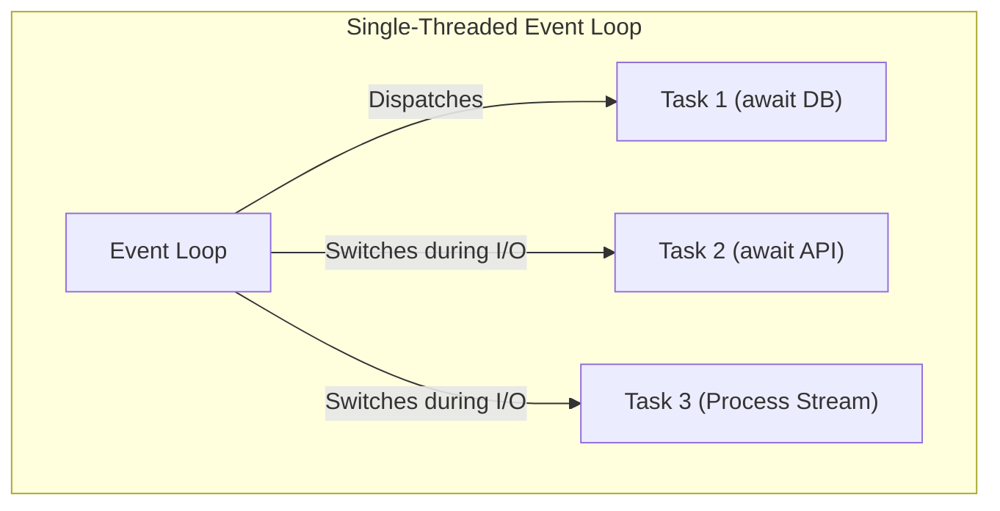

# Asynchronous Programming in Python (`asyncio`) ⚡

## Table of Contents
1. [Sync vs. Threading vs. Asynchronous I/O](#concurrency-models)
2. [The Event Loop & Coroutines (`async` and `await`)](#event-loop)
3. [Running Concurrent Tasks with `asyncio.gather` and `asyncio.TaskGroup`](#concurrent-tasks)
4. [Background Tasks with `asyncio.create_task`](#background-tasks)
5. [Rate Limiting and Throttling with `asyncio.Semaphore`](#semaphores)
6. [Asynchronous Generators & Iterators (`async for`)](#async-iterators)
7. [Asynchronous Context Managers (`async with`)](#async-context-managers)
8. [CPU-Bound vs. I/O-Bound Tasks (`loop.run_in_executor`)](#cpu-vs-io)
9. [Interview Questions & Common Pitfalls](#interview-questions)

---

## 1. Concurrency Models Explained {#concurrency-models}

| Model | Mechanism | Best For | GIL Impact |
| :--- | :--- | :--- | :--- |
| **Synchronous** | Sequential execution | Simple linear scripts | Blocked on I/O |
| **Multithreading** | OS-managed preemptive threads | I/O-bound with blocking legacy libs | Bound by Python GIL |
| **Multiprocessing** | Separate OS processes & memory | Heavy CPU computation / ML training | Bypasses GIL completely |
| **Asynchronous (`asyncio`)** | Single-threaded cooperative multitasking | High-concurrency I/O (Web servers, APIs, WebSockets) | Bypasses I/O wait with 0 thread overhead |



---

## 2. Coroutines: `async def` and `await` {#event-loop}

* `async def`: Defines a **coroutine function**. Calling it does not execute code immediately; it returns a coroutine object.
* `await`: Suspends the execution of the current coroutine, relinquishing control back to the Event Loop to let other tasks run while waiting for an asynchronous operation.

```python
import asyncio

async def fetch_data(api_id: int):
    print(f"Fetching from API #{api_id}...")
    await asyncio.sleep(1.0)  # Non-blocking async sleep
    print(f"Received data from API #{api_id}!")
    return {"id": api_id, "data": "OK"}

# Run the coroutine entry point
asyncio.run(fetch_data(1))
```

---

## 3. Concurrent Execution with `asyncio.gather` {#concurrent-tasks}

Instead of executing 10 requests sequentially (which takes 10 seconds), `asyncio.gather` executes all 10 simultaneously in ~1 second:

```python
async def main():
    tasks = [fetch_data(i) for i in range(1, 6)]
    results = await asyncio.gather(*tasks)
    print("All results:", results)

asyncio.run(main())
```

---

## 4. Rate Limiting with `asyncio.Semaphore` {#semaphores}

To avoid overwhelming external APIs or databases, limit the number of simultaneous active concurrent coroutines:

```python
async def safe_fetch(semaphore, url):
    async with semaphore:
        # At most 5 coroutines can enter this block at any given time
        return await download_from_url(url)
```
