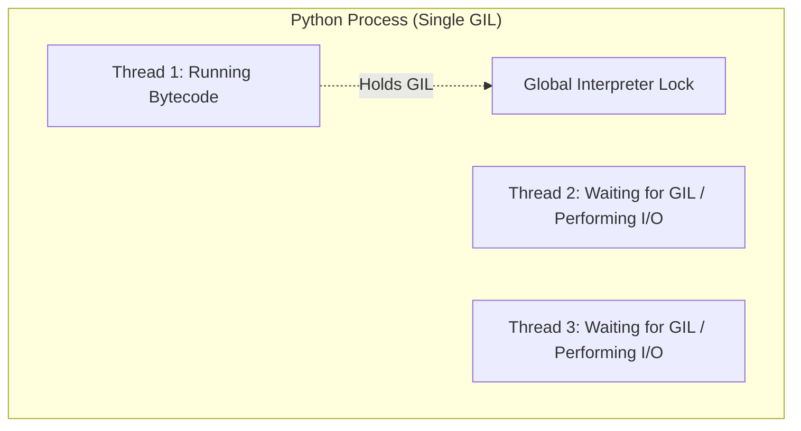

# Multithreading & Concurrency in Python 🧵

## Table of Contents
1. [The Global Interpreter Lock (GIL) Explained](#gil-explained)
2. [When to Use Multithreading vs. Multiprocessing](#threading-vs-multiprocessing)
3. [Creating Threads with `threading.Thread`](#creating-threads)
4. [Thread Synchronization: `threading.Lock` & `RLock`](#locks-and-rlocks)
5. [Preventing Deadlocks and Race Conditions](#race-conditions)
6. [Producer-Consumer Pattern with `queue.Queue`](#producer-consumer)
7. [High-Level Concurrency with `ThreadPoolExecutor`](#threadpoolexecutor)
8. [Thread Local Storage (`threading.local`)](#thread-local)
9. [Interview Questions & Common Pitfalls](#interview-questions)

---

## 1. The Global Interpreter Lock (GIL) Explained {#gil-explained}

The **GIL (Global Interpreter Lock)** is a mutex that protects access to Python objects, preventing multiple native threads from executing Python bytecodes simultaneously in a single process.



### Key Consequence:
* **CPU-Bound Tasks** (Matrix math, image rendering, parsing): Multithreading will NOT speed up Python CPU execution due to GIL contention. Use `multiprocessing` instead!
* **I/O-Bound Tasks** (File downloads, web scraping, database queries): The thread **releases the GIL** while waiting for I/O, allowing other threads to run concurrently. Multithreading provides massive speedups here.

---

## 2. Race Conditions & Mutex Locks (`threading.Lock`) {#locks-and-rlocks}

A **Race Condition** occurs when two threads modify a shared variable simultaneously without synchronization:

```python
import threading

balance = 100
lock = threading.Lock()

def withdraw(amount):
    global balance
    with lock:  # Acquires lock before modification, releases automatically
        if balance >= amount:
            balance -= amount
```

---

## 3. High-Level ThreadPoolExecutor {#threadpoolexecutor}

`concurrent.futures.ThreadPoolExecutor` provides clean worker pool management with `map()` and `submit()`:

```python
from concurrent.futures import ThreadPoolExecutor

urls = ["https://api.github.com", "https://python.org", "https://pypi.org"]

def download_site(url):
    import urllib.request
    with urllib.request.urlopen(url) as response:
        return f"{url} -> {len(response.read())} bytes"

with ThreadPoolExecutor(max_workers=5) as executor:
    results = executor.map(download_site, urls)
    for res in results:
        print(res)
```
