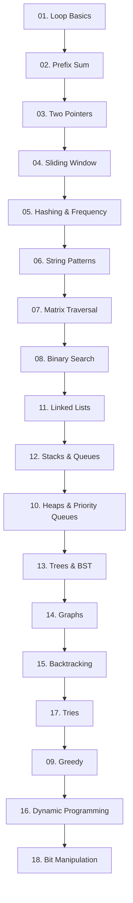
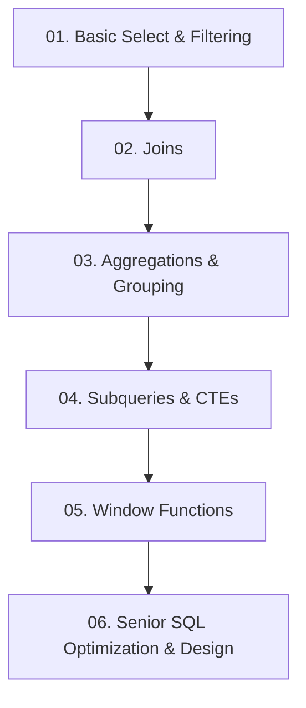

# Python DSA & SQL Practice Roadmap 🚀

Welcome to your personal learning repository! This workspace is structured to train your logic, data structures, algorithms, and SQL thinking step-by-step, taking you from a **3-year experience level up to a senior 5+ years experience standard**.

---

## 🗺️ Part 1: Python DSA Learning Pathway

To build the strongest logical foundation, practice the topics in this progressive order. **Do not skip steps!** Complete the Easy questions first before moving on to Medium and Hard questions.



### 📋 DSA Topic Index & Practice Files
1. **[01_loop_basics/loop_basics.ipynb](file:///e:/Learnings/Python-Coding/python_interview_patterns/01_loop_basics/loop_basics.ipynb)** - Fundamental iterations, math patterns.
2. **[02_prefix_sum/prefix_sum.ipynb](file:///e:/Learnings/Python-Coding/python_interview_patterns/02_prefix_sum/prefix_sum.ipynb)** - Subarray sum optimizations.
3. **[03_two_pointers/two_pointers_single.py](file:///e:/Learnings/Python-Coding/python_interview_patterns/03_two_pointers/two_pointers_single.py)** - O(N) array/string partition/traversal.
4. **[04_sliding_window/sliding_window_single.py](file:///e:/Learnings/Python-Coding/python_interview_patterns/04_sliding_window/sliding_window_single.py)** - Subarray/substring boundary tracking.
5. **[05_hashing_frequency/hashing_frequency_single.py](file:///e:/Learnings/Python-Coding/python_interview_patterns/05_hashing_frequency/hashing_frequency_single.py)** - Hashmap/set lookups, frequency count.
6. **[06_string_patterns/string_patterns_single.py](file:///e:/Learnings/Python-Coding/python_interview_patterns/06_string_patterns/string_patterns_single.py)** - Anagrams, palindromes, substring matches.
7. **[07_matrix_traversal/matrix_traversal_single.py](file:///e:/Learnings/Python-Coding/python_interview_patterns/07_matrix_traversal/matrix_traversal_single.py)** - 2D Grid DFS, BFS, diagonals, spirals.
8. **[08_binary_search/binary_search_single.py](file:///e:/Learnings/Python-Coding/python_interview_patterns/08_binary_search/binary_search_single.py)** - O(log N) search on sorted spaces.
9. **[11_linked_lists/linked_lists_single.py](file:///e:/Learnings/Python-Coding/python_interview_patterns/11_linked_lists/linked_lists_single.py)** - Pointers, slow/fast runners, reversal.
10. **[12_stacks_and_queues/stacks_and_queues_single.py](file:///e:/Learnings/Python-Coding/python_interview_patterns/12_stacks_and_queues/stacks_and_queues_single.py)** - Monotonic stacks, BFS queues, sliding windows.
11. **[10_heaps/heaps_single.py](file:///e:/Learnings/Python-Coding/python_interview_patterns/10_heaps/heaps_single.py)** - K-way merge, running medians, Top-K elements.
12. **[13_trees_and_bst/trees_and_bst_single.py](file:///e:/Learnings/Python-Coding/python_interview_patterns/13_trees_and_bst/trees_and_bst_single.py)** - DFS/BFS traversals, LCA, BST properties.
13. **[14_graphs/graphs_single.py](file:///e:/Learnings/Python-Coding/python_interview_patterns/14_graphs/graphs_single.py)** - Dijkstra, Topological Sort, Cycle Detection.
14. **[15_backtracking/backtracking_single.py](file:///e:/Learnings/Python-Coding/python_interview_patterns/15_backtracking/backtracking_single.py)** - N-Queens, Subsets, Permutations, Combinations.
15. **[17_tries/tries_single.py](file:///e:/Learnings/Python-Coding/python_interview_patterns/17_tries/tries_single.py)** - Prefix matching, autocomplete design.
16. **[09_greedy/greedy_single.py](file:///e:/Learnings/Python-Coding/python_interview_patterns/09_greedy/greedy_single.py)** - Local optimization, scheduling, intervals.
17. **[16_dynamic_programming/dynamic_programming_single.py](file:///e:/Learnings/Python-Coding/python_interview_patterns/16_dynamic_programming/dynamic_programming_single.py)** - Memoization, Tabulation, Knapsack, LIS.
18. **[18_bit_manipulation/bit_manipulation_single.py](file:///e:/Learnings/Python-Coding/python_interview_patterns/18_bit_manipulation/bit_manipulation_single.py)** - XOR operations, bitmasks, bit arithmetic.

---

## 🗺️ Part 2: SQL Practice Learning Pathway

For database mastery, connect **DBeaver** to the SQLite database and practice in this order:



### 📋 SQL Topic Index
1. **[01_basic_select_filtering/](file:///e:/Learnings/Python-Coding/sql_practice/01_basic_select_filtering/)** - SELECT, WHERE, LIKE, Null checks, ORDER BY.
2. **[02_joins/](file:///e:/Learnings/Python-Coding/sql_practice/02_joins/)** - INNER, LEFT, RIGHT, FULL, SELF JOIN.
3. **[03_aggregations_grouping/](file:///e:/Learnings/Python-Coding/sql_practice/03_aggregations_grouping/)** - SUM, AVG, GROUP BY, HAVING.
4. **[04_subqueries_ctes/](file:///e:/Learnings/Python-Coding/sql_practice/04_subqueries_ctes/)** - CTEs, IN, EXISTS, Set Operations.
5. **[05_window_functions/](file:///e:/Learnings/Python-Coding/sql_practice/05_window_functions/)** - RANK, LEAD, LAG, Running totals.
6. **[06_senior_sql_optimization_design/](file:///e:/Learnings/Python-Coding/sql_practice/06_senior_sql_optimization_design/)** - EXPLAIN PLAN, Indexes, Transactions, Recursive CTEs, MoM growth, Retention, Churn cohorts.

---

## 🚀 How to Practice

### 🐍 For Python DSA:
1. Open the `.py` file for your current topic.
2. Set `QUESTION_NUMBER` at the top of the script (e.g. `QUESTION_NUMBER = 3`).
3. Write your implementation inside the corresponding function (`q3`).
4. Run the file:
   ```bash
   python python_interview_patterns/<folder_name>/<file_name>.py
   ```

### 🛢️ For SQL:
1. Make sure you run `python sql_practice/init_db.py` to generate `practice.db`.
2. Connect **DBeaver** to `sql_practice/practice.db` (SQLite).
3. Open `questions.sql` in DBeaver, write your query under the question, and run it.
4. Verify your outputs against `solutions.sql`!
