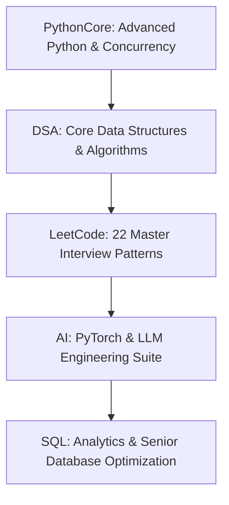

# Python Mastery, LeetCode DSA, AI & SQL Practice Hub 🚀

Welcome to your personal learning repository! This workspace is engineered to train your logic, deep engineering thinking, data structures, algorithms, and AI/PyTorch systems step-by-step, taking you from a **3-year experience level up to a senior 5+ years tech lead standard**.

---

## 🗺️ Master Architecture & Learning Tracks



---

## 📚 Track 1: Python Core & Concurrency (`PythonCore/`)
Comprehensive Markdown documentation and interactive cell-by-cell Python scripts (`.py`) for deep language mastery:

* **[01_Error_Handling/](file:///e:/Learnings/Python-Coding/PythonCore/01_Error_Handling/)**: Custom exceptions, hierarchy, tracebacks, and structured logging.
* **[02_Advanced_Functions/](file:///e:/Learnings/Python-Coding/PythonCore/02_Advanced_Functions/)**: Closures, partials, function introspection, and higher-order functions.
* **[03_Decorators/](file:///e:/Learnings/Python-Coding/PythonCore/03_Decorators/)**: `functools.wraps`, parameterized decorators (`@retry`), chaining, and class-based caching.
* **[04_Generators_Iterators/](file:///e:/Learnings/Python-Coding/PythonCore/04_Generators_Iterators/)**: Custom `__iter__`/`__next__`, `yield from`, memory benchmarking ($O(1)$ RAM), and log pipelines.
* **[05_Context_Managers/](file:///e:/Learnings/Python-Coding/PythonCore/05_Context_Managers/)**: `__enter__`/`__exit__`, `@contextmanager`, exception suppression, and `ExitStack`.
* **[06_Async_Programming/](file:///e:/Learnings/Python-Coding/PythonCore/06_Async_Programming/)**: Event loop, `asyncio.gather`, `Semaphore` throttling, and `run_in_executor`.
* **[07_Multithreading/](file:///e:/Learnings/Python-Coding/PythonCore/07_Multithreading/)**: GIL mechanics, `threading.Lock`, `queue.Queue` producer-consumer, and `ThreadPoolExecutor`.
* **[OOPs_Concepts/](file:///e:/Learnings/Python-Coding/PythonCore/OOPs_Concepts/)**: Inheritance, Encapsulation, Polymorphism, Abstraction, MRO, Descriptors, and Metaclasses.

---

## 🌲 Track 2: Core Data Structures & Algorithms (`DSA/`)
Interactive cell-by-cell scripts with visual execution and detailed Markdown guides:

1. **[01_Arrays_and_strings_interactive.py](file:///e:/Learnings/Python-Coding/DSA/01_Arrays_and_strings_interactive.py)**: CRUD, Two Pointers, Sliding Window, Prefix Sum.
2. **[02_Linked_Lists_interactive.py](file:///e:/Learnings/Python-Coding/DSA/02_Linked_Lists_interactive.py)**: Singly/Doubly lists, in-place reversal, Floyd's cycle detection.
3. **[03_Stacks_and_Queues_interactive.py](file:///e:/Learnings/Python-Coding/DSA/03_Stacks_and_Queues_interactive.py)**: Stack LIFO, Valid Parentheses, MinStack $O(1)$, Queue FIFO, Monotonic Stack.
4. **[04_Hashing_and_Hash_Tables_interactive.py](file:///e:/Learnings/Python-Coding/DSA/04_Hashing_and_Hash_Tables_interactive.py)**: Custom HashMap with chaining, Two Sum, Group Anagrams, Longest Consecutive Streak.
5. **[05_Trees_and_Binary_Search_Trees_interactive.py](file:///e:/Learnings/Python-Coding/DSA/05_Trees_and_Binary_Search_Trees_interactive.py)**: DFS Traversals, BFS Level-Order, BST Insert/Search, Lowest Common Ancestor.
6. **[06_Graphs_interactive.py](file:///e:/Learnings/Python-Coding/DSA/06_Graphs_interactive.py)**: BFS Shortest Path, DFS Cycle Detection, Dijkstra's Algorithm, Kahn's Topological Sort.
7. **[07_Sorting_Algorithms_interactive.py](file:///e:/Learnings/Python-Coding/DSA/07_Sorting_Algorithms_interactive.py)**: Insertion Sort, Merge Sort $O(N \log N)$, Quick Sort, Linear Counting Sort.
8. **[08_Searching_Algorithms_interactive.py](file:///e:/Learnings/Python-Coding/DSA/08_Searching_Algorithms_interactive.py)**: Binary Search, Rotated Sorted Array, First & Last Bounds, Search on Solution Space.
9. **[09_Dynamic_Programming_interactive.py](file:///e:/Learnings/Python-Coding/DSA/09_Dynamic_Programming_interactive.py)**: Memoization vs Tabulation, 0/1 Knapsack, LCS 2D Grid, Coin Change.
10. **[10_Greedy_Algorithms_interactive.py](file:///e:/Learnings/Python-Coding/DSA/10_Greedy_Algorithms_interactive.py)**: Activity Selection, Fractional Knapsack, Jump Game, Gas Station Circular Tour.

---

## 🎯 Track 3: 22 Master LeetCode Interview Patterns (`python_interview_patterns/`)
Curated questions with automated test runners covering 95%+ of LeetCode patterns:

```
01. Loop Basics ➔ 02. Prefix Sum ➔ 03. Two Pointers ➔ 04. Sliding Window ➔ 05. Hashing & Frequency
➔ 06. String Patterns ➔ 07. Matrix Traversal ➔ 08. Binary Search (inc. on Answer Space)
➔ 11. Linked Lists ➔ 12. Stacks & Queues ➔ 10. Heaps & Priority Queues ➔ 13. Trees & BST
➔ 14. Graphs (inc. Multi-Source BFS) ➔ 15. Backtracking ➔ 17. Tries ➔ 09. Greedy 
➔ 16. Dynamic Programming ➔ 18. Bit Manipulation ➔ 19. Union-Find (DSU) 
➔ 20. Cyclic Sort ➔ 21. Data Structure Design ➔ 22. Intervals & Monotonic Deque
```

* **[19_union_find/union_find.py](file:///e:/Learnings/Python-Coding/python_interview_patterns/19_union_find/union_find.py)**: DSU with Path Compression & Rank, Redundant Connection, Accounts Merge, Kruskal's MST.
* **[20_cyclic_sort/cyclic_sort.py](file:///e:/Learnings/Python-Coding/python_interview_patterns/20_cyclic_sort/cyclic_sort.py)**: First Missing Positive, Find Duplicate Number, Disappeared Numbers in $O(1)$ space.
* **[21_data_structure_design/data_structure_design.py](file:///e:/Learnings/Python-Coding/python_interview_patterns/21_data_structure_design/data_structure_design.py)**: LRU Cache, Min Stack, Time-Based KV Store, LFU Cache, Snapshot Array, Design Twitter.
* **[22_intervals_and_monotonic/intervals_and_monotonic.py](file:///e:/Learnings/Python-Coding/python_interview_patterns/22_intervals_and_monotonic/intervals_and_monotonic.py)**: Merge/Insert Intervals, Meeting Rooms I & II, Sliding Window Maximum Monotonic Deque.

---

## 🤖 Track 4: PyTorch & AI Deep Learning Suite (`AI/`)
From tensor fundamentals to staff-level LLM architectures with runnable self-testing benchmarks:

* **🟢 Beginner**: **[AI/01_beginner_pytorch/](file:///e:/Learnings/Python-Coding/AI/01_beginner_pytorch/)** (Tensors, Autograd, Regressions, MLPs, Custom Collate NLP padding)
* **🟡 Intermediate**: **[AI/02_intermediate_pytorch/](file:///e:/Learnings/Python-Coding/AI/02_intermediate_pytorch/)** (Transforms, ResNet Blocks, BiLSTM Packed Sequences, Schedulers & Early Stopping, Transfer Learning)
* **🔴 Advanced Interview Level**: **[AI/03_advanced_interview_pytorch/](file:///e:/Learnings/Python-Coding/AI/03_advanced_interview_pytorch/)** (Multi-Head Self-Attention from scratch, Custom Autograd & Focal Loss, LoRA Fine-Tuning, Mixed Precision AMP, KV-Cache LLM Inference)

---

## 🛢️ Track 5: SQL Practice & Sandbox (`sql_practice/`)
Connect **DBeaver** to `practice.db` and master query logic:
1. **[01_basic_select_filtering/](file:///e:/Learnings/Python-Coding/sql_practice/01_basic_select_filtering/)** - SELECT, WHERE, LIKE, Null checks, ORDER BY.
2. **[02_joins/](file:///e:/Learnings/Python-Coding/sql_practice/02_joins/)** - INNER, LEFT, RIGHT, FULL, SELF JOIN.
3. **[03_aggregations_grouping/](file:///e:/Learnings/Python-Coding/sql_practice/03_aggregations_grouping/)** - SUM, AVG, GROUP BY, HAVING.
4. **[04_subqueries_ctes/](file:///e:/Learnings/Python-Coding/sql_practice/04_subqueries_ctes/)** - CTEs, IN, EXISTS, Set Operations.
5. **[05_window_functions/](file:///e:/Learnings/Python-Coding/sql_practice/05_window_functions/)** - RANK, LEAD, LAG, Running totals.
6. **[06_senior_sql_optimization_design/](file:///e:/Learnings/Python-Coding/sql_practice/06_senior_sql_optimization_design/)** - EXPLAIN PLAN, Indexes, Transactions, Recursive CTEs, MoM growth.

---

## ⚡ Complete "How-To-Run" Guide with Examples

### 1. 🐍 Running PythonCore Interactive Modules
Every module supports cell-level execution or sequential all-cell execution:

```bash
# Run a specific cell (e.g., Cell 2 of Decorators):
python PythonCore/03_Decorators/03_decorators_interactive.py 2

# Run a specific cell of Async Programming (e.g., Cell 1):
python PythonCore/06_Async_Programming/06_async_programming_interactive.py 1

# Run a specific cell of OOP Concepts (e.g., Cell 3 of Inheritance):
python PythonCore/OOPs_Concepts/01_inheritance_interactive.py 3

# Run all cells in sequence:
python PythonCore/05_Context_Managers/05_context_managers_interactive.py --all
python PythonCore/07_Multithreading/07_multithreading_interactive.py --all
```

---

### 2. 🌲 Running DSA Interactive Modules
```bash
# Run a specific cell (e.g., Cell 3 of Graphs: Dijkstra's Algorithm):
python DSA/06_Graphs_interactive.py 3

# Run Cell 4 of Searching (Binary Search on Answer Space):
python DSA/08_Searching_Algorithms_interactive.py 4

# Run Cell 2 of Dynamic Programming (0/1 Knapsack):
python DSA/09_Dynamic_Programming_interactive.py 2

# Run all cells in sequence:
python DSA/01_Arrays_and_strings_interactive.py --all
python DSA/05_Trees_and_Binary_Search_Trees_interactive.py --all
```

---

### 3. 🎯 Running LeetCode Patterns with Auto-Test Runner
Open any problem file, write your logic inside function `qX`, and run:
```bash
# Auto-runs the question you are currently writing:
python python_interview_patterns/08_binary_search/binary_search.py

# Explicitly test a specific question number (e.g., Q10):
python python_interview_patterns/19_union_find/union_find.py 10
python python_interview_patterns/20_cyclic_sort/cyclic_sort.py 6
python python_interview_patterns/21_data_structure_design/data_structure_design.py 1
python python_interview_patterns/22_intervals_and_monotonic/intervals_and_monotonic.py 9
```

---

### 4. 🤖 Running PyTorch & AI Deep Learning Modules
Each file includes its own self-testing assertion suite and live benchmarks:
```bash
# Beginner Tests:
python AI/01_beginner_pytorch/01_tensor_basics.py
python AI/01_beginner_pytorch/05_datasets_and_dataloaders.py

# Intermediate Tests:
python AI/02_intermediate_pytorch/02_cnn_and_residual_blocks.py
python AI/02_intermediate_pytorch/04_training_pipeline_best_practices.py

# Advanced / LLM Interview Tests:
python AI/03_advanced_interview_pytorch/01_multihead_attention_and_transformer.py
python AI/03_advanced_interview_pytorch/03_lora_from_scratch.py
python AI/03_advanced_interview_pytorch/05_llm_inference_kv_cache.py
```

---

### 5. 🛢️ Running SQL Practice in DBeaver
1. Initialize the SQLite database:
   ```bash
   python sql_practice/init_db.py
   ```
2. Open **DBeaver**, create a new SQLite Connection pointing to `sql_practice/practice.db`.
3. Open `questions.sql`, write your query under the question, and run it.
4. Verify your outputs against `solutions.sql`!

---

### 💡 Pro-Tip for VS Code & PyCharm Users: Interactive Cell Mode
All interactive `.py` files in `PythonCore/` and `DSA/` use standard `# %% [markdown]` and `# %% [code]` cell headers.
* In **VS Code / Cursor / PyCharm**: Click **`Run Cell`** above any `# %%` header or press **`Shift + Enter`** to execute that individual block in the Interactive Window with live variables and inline plots!
